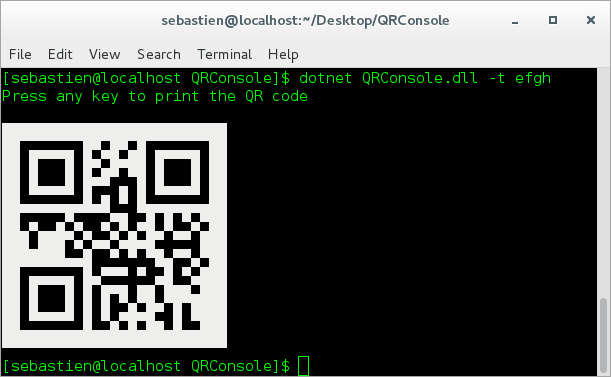
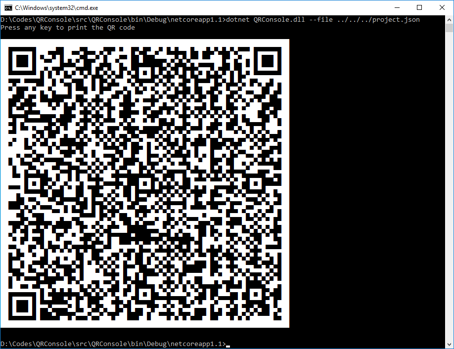
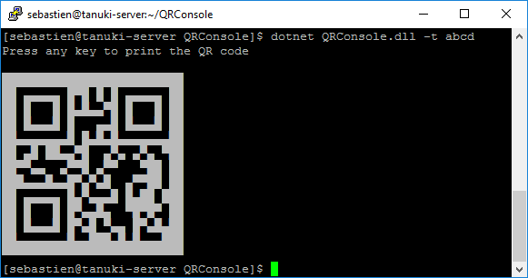
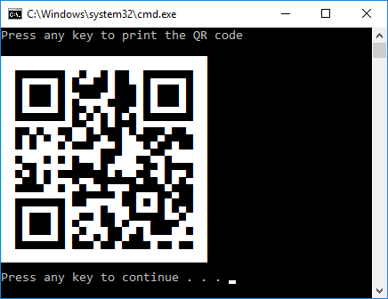

# Overview

This is a console application that encodes text or file content into a QR code, and prints it directly in the console.

# How to use

Argument&nbsp;&nbsp;&nbsp;&nbsp;&nbsp;| Description | Allowed value
-----------|-------------|--------------
`-t` `--text` | Text to encode into a QR code | Any text, enclose in quotes if there are spaces
`-f` `--file` | File containing text to encode into a QR code| Any filename, relative or absolute
`-c` `--clear` | Clears the console before printing the QR code | -
`-w` `--no-wait` | Does not pause before printing the QR code | -
`-b` `--base64` | Encodes the file content to base 64 before encoding it to QR code (useful for binary files) | -
`-e` `--encoding` | Encoding of the file content | Codepage (number), or encoding name (string), defaults to UTF-8

Notes:
- The options `--text` and `--file` are mutually exclusive.
- The option `--encoding` is used only in `--file` mode without `--base64`.

# Additional information

- Your terminal color scheme must be set with a black (or very dark) background color.

- By default the application awaits before printing the QR code, this is to give you time to resize the console before printing the code. 
On Windows, sometimes resizing the console breaks the content already printed, so it is recommended to resize before.

- The behavior to print the characters in not the same on Windows and Linux. 
On Windows, the console output encoding is set to Unicode, whereas on other platforms, the console output encoding is set to UTF8. 
Tested only on Windows, Linux, and on a Linux through SSH using putty on Windows.

# Screenshots

**A large text** *(the largest printable on one screen at this resolution)*

**In putty running on a CentOS 7**

**A small text**

